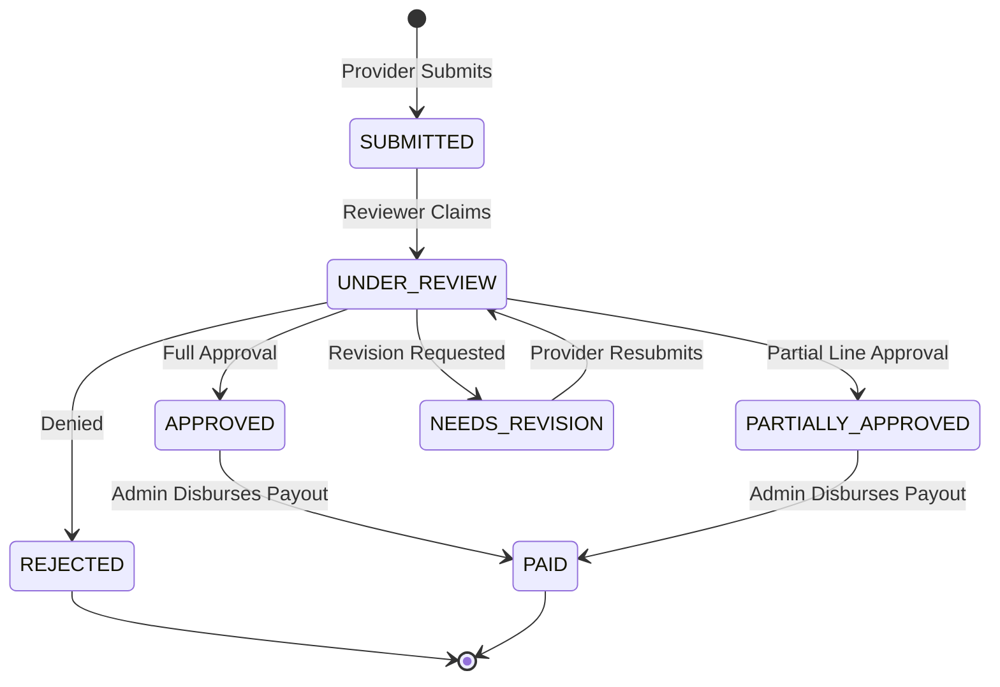

# ClaimCare — Full-Stack Health Insurance Claims Platform

ClaimCare is a modern, full-stack health insurance claims processing platform designed to streamline the workflow between **Healthcare Providers**, **Medical Reviewers**, and **System Administrators**.

It implements a strictly validated state machine for claim adjudication, real-time WebSocket notifications, a dynamic policy calculation engine, rule-based fraud detection, printable Explanation of Benefits (EOB) statements, and an immutable audit trail.

---

## 🔗 Project Links & Video Demo

- 🎥 **Video Walkthrough (Vimeo)**: [https://vimeo.com/1214711522](https://vimeo.com/1214711522)
- 💻 **GitHub Repository**: [https://github.com/sagardudhat/Health-Insurance-Claims-Platform](https://github.com/sagardudhat/Health-Insurance-Claims-Platform)

---

## 🏗 Architectural Overview

ClaimCare uses a modular **Monorepo** structure:

- **Frontend (`/frontend`)**: Built with **Next.js 14 (App Router)**, React 18, Zustand state management, TanStack React Query, and Tailwind CSS. Employs a Feature-Sliced Design (`src/features`) with thin page wrappers around domain-specific components.
- **Backend (`/backend`)**: Built with **Node.js, Express, and TypeScript**. Follows a strict 3-tier Layered Architecture (Controllers $\rightarrow$ Services $\rightarrow$ Repositories) with **MongoDB & Mongoose** data persistence.

---

## 🔄 Claim Adjudication State Machine

Claims transition through a strictly enforced state machine map governed by backend validation:



---

## 👥 User Guides (All 3 Platform Roles)

### 🩺 1. Healthcare Provider Guide (`provider`)
Providers submit and manage medical claims for patient care.

- **Submit New Claims**:
  1. Fill in Patient Name, Policy Number, DOB, Procedure Details, and Itemized Line Items.
  2. Upload mandatory supporting documents (PDF, JPEG, PNG up to 5MB).
  3. Submit claim $\rightarrow$ moves to `SUBMITTED` status and notifies Reviewers in real time.
- **Track Claim Statuses**: View real-time status badges, itemized cost breakdowns, and patient responsibility on the Provider Dashboard.
- **Revise & Resubmit Claims**:
  1. If a claim is marked `NEEDS_REVISION` by a reviewer, click **Edit & Resubmit**.
  2. Update patient details, line item quantities/costs, or attach additional files.
  3. Resubmit $\rightarrow$ claim status moves to `UNDER_REVIEW`, emitting real-time WebSocket alerts (**"Revised Claim Resubmitted for Review"**) to reviewers.
- **Generate EOB Statements**: Click **Print EOB** on any approved/paid claim to generate an official printable Explanation of Benefits (EOB) document.

---

### 🔍 2. Medical Reviewer Guide (`reviewer`)
Reviewers adjudicate claims, inspect medical documentation, and approve insurance payouts.

- **Medical Review Queue**: View all claims waiting for review sorted by submission/priority.
- **Adjudicate Claims**:
  - **Approve Full Claim**: Approves all line items $\rightarrow$ triggers backend Policy Engine calculation.
  - **Partially Approve**: Select specific line items to deny (e.g. uncovered cosmetic add-ons).
  - **Request Revision (`NEEDS_REVISION`)**: Send claim back to provider with mandatory reviewer notes specifying missing documentation.
  - **Reject Claim**: Denies reimbursement for non-covered procedures.
- **Live Coverage Preview**: The adjudication modal queries the Policy Engine to preview exact **Approved Charges**, **Deductible Applied**, **Insurer Payout (80%)**, and **Patient Owes** before submitting decisions.
- **Smart Navigation**: Click the Back arrow on any claim detail page to return to the exact origin list (`/reviewer/claims`, `/reviewer/queue`, or `/reviewer/dashboard`).

---

### 🛡️ 3. Platform Administrator Guide (`admin`)
Administrators oversee system operations, financial disbursements, fraud detection, and policy rules.

- **Platform Analytics**: Bird's-eye dashboard displaying total claims, pending queue, total insurance payout disbursed, and flagged fraud count.
- **Dynamic System Policy Settings**:
  - **Annual Deductible** (Default `$500`): Yearly deductible amount absorbed per policy year.
  - **Coverage Rate** (Default `80%`): Percentage covered by insurance post-deductible.
  - **Annual Coverage Limit** (Default `$10,000`): Maximum insurance payout cap per calendar year.
- **Rule-Based Fraud Audit**:
  - Claims exceeding 3x the historical average cost for their procedure code are automatically flagged with an `Audit Flagged` badge.
  - Administrators can review the anomaly rationale and click **Unflag Claim** with audit logging.
- **Disburse Payouts**: Move `APPROVED` and `PARTIALLY_APPROVED` claims to final `PAID` status.
- **Immutable Audit Trail**: Inspect an uneditable log of every action, timestamp, performer, and note for full regulatory compliance.

---

## 💰 Dynamic Policy Engine Logic

Claim payouts and patient responsibilities are calculated dynamically using historical policy data:

$$\text{Remaining Deductible} = \max(0, \text{Annual Deductible} - \text{Deductible Already Met This Year})$$

$$\text{Deductible Applied} = \min(\text{Approved Total}, \text{Remaining Deductible})$$

$$\text{After Deductible} = \max(0, \text{Approved Total} - \text{Deductible Applied})$$

$$\text{Raw Covered (80\%)} = \text{After Deductible} \times 0.80$$

$$\text{Insurer Payout} = \min(\text{Raw Covered}, \text{Remaining Annual Limit})$$

$$\text{Patient Responsibility} = \text{Total Claimed} - \text{Insurer Payout}$$

> [!NOTE]
> **Approval Order Principle**: Deductible accumulation orders prior claims by **Approval Order** (`updatedAt`), ensuring that whichever claim is approved or partially approved first absorbs the annual deductible.

---

## 🚀 Getting Started & Local Setup

### Prerequisites
- **Node.js** (v20+ recommended)
- **MongoDB** (Local instance or Atlas URI)

---

### 1. Backend Setup (`/backend`)

```bash
# Navigate to backend directory
cd backend

# Install dependencies
npm install

# Create environment configuration file (.env)
cat <<EOT > .env
PORT=5000
MONGO_URI=mongodb://127.0.0.1:27017/claimcare
JWT_SECRET=super_secret_jwt_key_claimcare_2026
NODE_ENV=development
EOT

# Seed database with demo accounts & policy configs
npm run seed

# Run Backend Unit Tests (Coverage Engine)
npm run test

# Start Express server (with hot-reloading)
npm run dev
```
*Backend server will start at `http://localhost:5000`.*

---

### 2. Frontend Setup (`/frontend`)

```bash
# Navigate to frontend directory
cd frontend

# Install dependencies
npm install

# Create local environment configuration (.env.local)
cat <<EOT > .env.local
NEXT_PUBLIC_API_URL=http://localhost:5000/api
EOT

# Start Next.js development server
npm run dev
```
*Frontend application will start at `http://localhost:3000`.*

---

## 🔑 Demo Login Accounts

| Role | Email | Password | Dashboard URL |
| :--- | :--- | :--- | :--- |
| **Healthcare Provider** | `provider@claimcare.health` | `provider123` | `http://localhost:3000/provider/dashboard` |
| **Medical Reviewer** | `reviewer@claimcare.health` | `reviewer123` | `http://localhost:3000/reviewer/dashboard` |
| **Platform Administrator** | `admin@claimcare.health` | `admin123` | `http://localhost:3000/admin/dashboard` |

---

## 📚 Interactive API Documentation (Swagger / OpenAPI 3.0)

- **Interactive Swagger UI**: `http://localhost:5000/api-docs`
- **OpenAPI 3.0 JSON Spec**: `http://localhost:5000/api-docs/json`

---

## 📂 Repository Directory Structure

```
claimcare/
├── backend/                  # Express / Node.js API
│   ├── src/
│   │   ├── config/           # OpenAPI / Swagger & policy defaults
│   │   ├── controllers/      # Route controllers (Express handlers)
│   │   ├── middleware/       # Auth JWT, Multer Upload & Validation
│   │   ├── models/           # Mongoose schemas (Claim, User, AuditLog)
│   │   ├── repositories/     # Data Access Layer
│   │   ├── routes/           # Express API routers
│   │   ├── services/         # Domain Business Logic Layer
│   │   └── tests/            # Unit tests for Policy Engine
│   └── package.json
└── frontend/                 # Next.js 14 App Router App
    ├── src/
    │   ├── app/              # Thin page route wrappers
    │   ├── components/       # Global UI components (NotificationCenter, EOB PDF)
    │   ├── features/         # Feature-Sliced Design modules
    │   │   ├── admin/        # Admin dashboard & settings
    │   │   ├── auth/         # Login & Register view components
    │   │   ├── claims/       # Provider submission & claim details
    │   │   └── review/       # Reviewer queue & adjudication modal
    │   └── lib/              # Axios API client & helpers
    └── package.json
```
