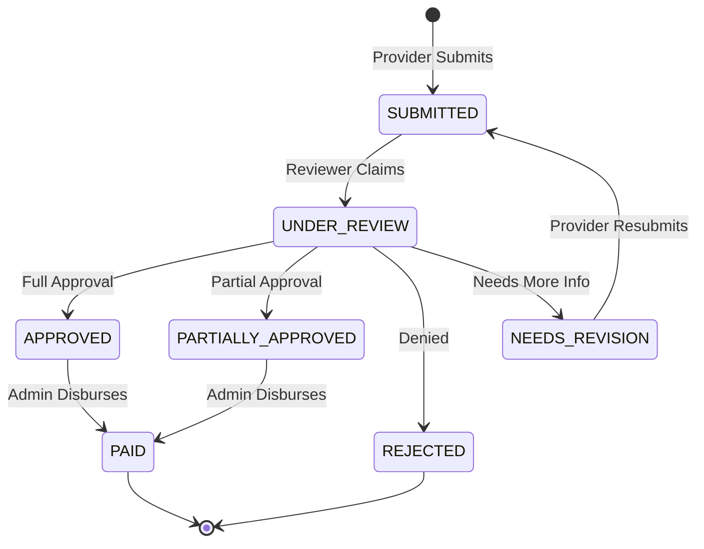

# ClaimCare - Health Insurance Claims Platform

ClaimCare is a modern, full-stack health insurance claims processing platform designed to streamline the workflow between Healthcare Providers, Medical Reviewers, and System Administrators. 

This platform implements a robust state machine for claim adjudication, offering real-time tracking, structured data validation, and an intuitive user interface.

---

## 🏗 Architectural Overview

ClaimCare employs a modern **Monorepo** structure, split into a React/Next.js frontend and a Node.js/Express backend.

- **Frontend (`/frontend`)**: Built with **Next.js 14 (App Router)**, React 18, and Tailwind CSS. It uses a strictly modular, feature-based architecture (`src/features`) where pages act as thin wrappers around highly cohesive View components. State is managed via `Zustand` and server state via `@tanstack/react-query`.
- **Backend (`/backend`)**: Built with **Node.js, Express, and TypeScript**. It follows a strict 3-tier Layered Architecture (Controllers → Services → Repositories) for maximum separation of concerns. Data persistence is handled via **MongoDB** and `Mongoose`.

---

## 🔄 Claim Adjudication State Machine

Claims move through a strictly validated state machine governed by the backend core logic.



---

## 👥 Role-Based Access Control (RBAC)

The platform supports three distinct roles, each with custom dashboards and permissions:

1. **Healthcare Provider (`provider`)**
   - Can submit new claims (with PDF/Image attachments).
   - Can view the status of their own claims.
   - Can update claims that are marked as `NEEDS_REVISION`.
2. **Medical Reviewer (`reviewer`)**
   - Can view the global queue of submitted claims.
   - Can adjudicate claims (`APPROVED`, `REJECTED`, `PARTIALLY_APPROVED`, `NEEDS_REVISION`).
3. **Platform Admin (`admin`)**
   - Has a bird's-eye view of all platform statistics (Fraud flags, payout summaries).
   - Can view an uneditable audit trail of all claims.
   - Can manage user accounts.

---

## 🚀 Getting Started

### Prerequisites
- Node.js (v20+ recommended)
- MongoDB (Local instance or Atlas URI)

### Global Setup
1. Clone the repository.
2. The project is split into two directories: `frontend` and `backend`.

---

## 📦 Backend Setup (`/backend`)

The backend requires environment variables to connect to MongoDB and sign JWT tokens.

1. **Navigate to the backend directory:**
   ```bash
   cd backend
   ```
2. **Install dependencies:**
   ```bash
   npm install
   ```
3. **Configure Environment Variables:**
   Create a `.env` file in the `backend/` directory:
   ```env
   PORT=5000
   MONGO_URI=mongodb://127.0.0.1:27017/claimcare
   JWT_SECRET=your_super_secret_jwt_key_change_in_production
   NODE_ENV=development
   ```
4. **Run the Development Server:**
   ```bash
   npm run dev
   ```
   *The server will start on `http://localhost:5000`.*

---

## 💻 Frontend Setup (`/frontend`)

The frontend requires environment variables to communicate with the backend API.

1. **Navigate to the frontend directory:**
   ```bash
   cd frontend
   ```
2. **Install dependencies:**
   ```bash
   npm install
   ```
3. **Configure Environment Variables:**
   Create a `.env.local` file in the `frontend/` directory:
   ```env
   NEXT_PUBLIC_API_URL=http://localhost:5000/api
   ```
4. **Run the Development Server:**
   ```bash
   npm run dev
   ```
   *The application will start on `http://localhost:3000`.*

---

## 🛡 Coverage & Validation Rules

The application enforces strict data validation using **Zod** on both the frontend and backend.
- **File Uploads**: Claims require a supporting document. Only `PDF`, `JPEG`, and `PNG` are allowed. Max size is 5MB.
- **Date of Service**: Cannot be in the future.
- **Diagnosis Codes**: Must conform to standard ICD-10 formats.
- **Totals**: `totalClaimed` must be greater than 0.

---

## 📂 Repository Structure

```
claimcare/
├── backend/                  # Express/Node.js API
│   ├── src/
│   │   ├── controllers/      # Route handlers
│   │   ├── middleware/       # Auth, Upload, Error handling
│   │   ├── models/           # Mongoose schemas
│   │   ├── repositories/     # Data access layer
│   │   ├── routes/           # Express routers
│   │   ├── services/         # Business logic layer
│   │   └── utils/            # Helpers
│   └── package.json
└── frontend/                 # Next.js Application
    ├── src/
    │   ├── app/              # Next.js App Router (Thin Wrappers)
    │   ├── components/       # Global Shared UI Components
    │   ├── features/         # Feature-Sliced Design Modules
    │   │   ├── admin/        # Admin domain components & hooks
    │   │   ├── auth/         # Auth domain components & hooks
    │   │   ├── claims/       # Provider claims domain
    │   │   └── review/       # Reviewer domain
    │   └── config/           # Global constants
    └── package.json
```
