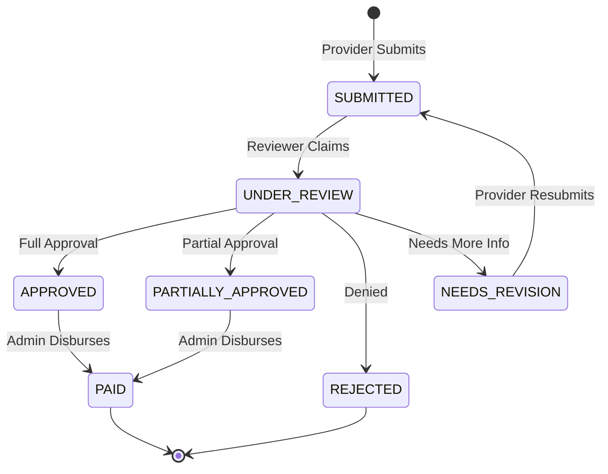

# ClaimCare - Health Insurance Claims Platform

ClaimCare is a modern, full-stack health insurance claims processing platform designed to streamline the workflow between Healthcare Providers, Medical Reviewers, and System Administrators. 

This platform implements a robust state machine for claim adjudication, offering real-time tracking, structured data validation, and an intuitive user interface.

---

## 🏗 Architectural Overview

ClaimCare employs a modern **Monorepo** structure, split into a React/Next.js frontend and a Node.js/Express backend.

- **Frontend (`/frontend`)**: Built with **Next.js 14 (App Router)**, React 18, and Tailwind CSS. It uses a strictly modular, feature-based architecture (`src/features`) where pages act as thin wrappers around highly cohesive View components. State is managed via `Zustand` and server state via `@tanstack/react-query`.
- **Backend (`/backend`)**: Built with **Node.js, Express, and TypeScript**. It follows a strict 3-tier Layered Architecture (Controllers → Services → Repositories) for maximum separation of concerns. Data persistence is handled via **MongoDB** and `Mongoose`.

---

## 🔄 Claim Adjudication State Machine

Claims move through a strictly validated state machine governed by the backend core logic.



---

## 👥 Role-Based Access Control (RBAC)

The platform supports three distinct roles, each with custom dashboards and permissions:

1. **Healthcare Provider (`provider`)**
   - Can submit new claims (with PDF/Image attachments).
   - Can view the status of their own claims.
   - Can update claims that are marked as `NEEDS_REVISION`.
2. **Medical Reviewer (`reviewer`)**
   - Can view the global queue of submitted claims.
   - Can adjudicate claims (`APPROVED`, `REJECTED`, `PARTIALLY_APPROVED`, `NEEDS_REVISION`).
3. **Platform Admin (`admin`)**
   - Has a bird's-eye view of all platform statistics (Fraud flags, payout summaries).
   - Can view an uneditable audit trail of all claims.
   - Can manage user accounts.
   - Can dynamically adjust policy rules (Annual Limit, Deductibles, Coverage Rates) from System Settings.

---

## 🚀 Getting Started

### Prerequisites
- Node.js (v20+ recommended)
- MongoDB (Local instance or Atlas URI)

### Global Setup
1. Clone the repository.
2. The project is split into two directories: `frontend` and `backend`.

---

## 📦 Backend Setup (`/backend`)

The backend requires environment variables to connect to MongoDB and sign JWT tokens.

1. **Navigate to the backend directory:**
   ```bash
   cd backend
   ```
2. **Install dependencies:**
   ```bash
   npm install
   ```
3. **Configure Environment Variables:**
   Create a `.env` file in the `backend/` directory:
   ```env
   PORT=5000
   MONGO_URI=mongodb://127.0.0.1:27017/claimcare
   JWT_SECRET=your_super_secret_jwt_key_change_in_production
   NODE_ENV=development
   ```
4. **Run Unit Tests (Coverage Calculation Logic):**
   ```bash
   npm run test
   ```
5. **Run the Development Server:**
   ```bash
   npm run dev
   ```
   *The server will start on `http://localhost:5000`.*

---

## 💻 Frontend Setup (`/frontend`)

The frontend requires environment variables to communicate with the backend API.

1. **Navigate to the frontend directory:**
   ```bash
   cd frontend
   ```
2. **Install dependencies:**
   ```bash
   npm install
   ```
3. **Configure Environment Variables:**
   Create a `.env.local` file in the `frontend/` directory:
   ```env
   NEXT_PUBLIC_API_URL=http://localhost:5000/api
   ```
4. **Run the Development Server:**
   ```bash
   npm run dev
   ```
   *The application will start on `http://localhost:3000`.*

---

## 🛡 Coverage & Validation Rules

The application enforces strict data validation using **Zod** on both the frontend and backend.
- **File Uploads**: Claims require a supporting document. Only `PDF`, `JPEG`, and `PNG` are allowed. Max size is 5MB.
- **Date of Service**: Cannot be in the future.
- **Diagnosis Codes**: Must conform to standard ICD-10 formats.
- **Totals**: `totalClaimed` must be greater than 0.

### 💰 Dynamic Policy Engine
Claim payouts and patient responsibilities are calculated dynamically based on policy rules stored in MongoDB (`PolicyConfig` collection):
- **Annual Deductible**: (Default `$500`) Deductible remaining is applied to approved claim items before coverage kicks in.
- **Coverage Percentage**: (Default `80%`) Insurance covers 80% of eligible expenses after deductible; patient pays 20% coinsurance.
- **Annual Coverage Limit**: (Default `$10,000`) Maximum insurance payout per policy year.
### 📄 Explanation of Benefits (EOB) PDF Generation
- **Official Insurance Statements**: Allows providers, reviewers, and admins to view and generate printable Explanation of Benefits (EOB) PDF statements.
- **Statement ID & Watermark**: Includes formal header, Statement ID (`EOB-XXXXXXXX`), Patient/Provider details, financial payout summary cards, itemized service breakdown with denial statuses, and formal legal appeals notices.
- **Print & Save as PDF**: Fully formatted for standard A4/Letter print rendering via `window.print()`.

### 📚 Interactive API Documentation (Swagger / OpenAPI 3.0)
- **Interactive UI**: Complete RESTful API documentation served directly at `http://localhost:5000/api-docs`.
- **OpenAPI 3.0 JSON Spec**: Available at `http://localhost:5000/api-docs/json` for importing directly into Postman or Insomnia.
- **Try-It-Out Endpoint Testing**: Includes request/response schemas, JWT Bearer token authentication header parameters, and full endpoint descriptions.

### ⚡ Real-time WebSockets (Socket.io)
- **Live Event Broadcasting**: Socket.io server running on Express emits `claim_status_updated` and `claim_submitted` events.
- **Frontend Real-time Feed**: Real-time WebSocket notifications update the UI and populate the header notification drawer without requiring manual browser refreshes.

### 📧 Email Notification Engine (`email.service.ts`)
- **Automated Email Triggers**: Triggered directly inside the `claim.service.ts` status transition API pipeline.
- **HTML & Console Dispatch Logs**: Dispatches tailored email templates (`CLAIM_SUBMITTED`, `STATUS_UPDATED`, `REVISION_REQUESTED`, `PAYMENT_DISBURSED`) to providers and reviewers with complete claim references and audit rationale.

---

## 🏛 Architectural Decisions & Trade-offs

1. **State Machine & Status Transitions**
   - **Decision**: Implemented an explicit `ALLOWED_TRANSITIONS` state-machine map in `claim.service.ts`.
   - **Why**: Prevents illegal workflow jumps (e.g., directly moving from `SUBMITTED` to `PAID` without review).
   - **Trade-off**: Requires strict backend validation for every status update API request (returns 409 Conflict for invalid moves).

2. **Immutable Audit Trail**
   - **Decision**: Every status transition or note entry creates an append-only document in the `AuditLog` collection.
   - **Why**: Ensures complete regulatory compliance and non-repudiation for financial and legal accountability.
   - **Trade-off**: Increases collection size over time, offset by indexing `claimId` for $O(1)$ fast lookups.

3. **Rule-Based Fraud Flagging Engine**
   - **Decision**: Claims exceeding 3x the historical average for their procedure code are automatically flagged.
   - **Why**: Provides an immediate, transparent, and computationally light algorithm without introducing ML pipeline overhead.
   - **Trade-off**: May produce false positives for complex cases; addressed by providing admins an `Unflag Claim` action with audit logging.

4. **Dynamic Database Coverage Calculations vs Static Config**
   - **Decision**: Dynamic accumulation of yearly deductibles and limits on-the-fly from historical approved claims in MongoDB.
   - **Why**: Eliminates stale cached balances and ensures $100\%$ accuracy if prior claims are adjusted or cancelled.
   - **Trade-off**: Requires querying historical claims per policy during adjudication, optimized with compound indexes on `{ "patient.policyNumber": 1, status: 1 }`.

---

## 📂 Repository Structure

```
claimcare/
├── backend/                  # Express/Node.js API
│   ├── src/
│   │   ├── controllers/      # Route handlers
│   │   ├── middleware/       # Auth, Upload, Error handling
│   │   ├── models/           # Mongoose schemas
│   │   ├── repositories/     # Data access layer
│   │   ├── routes/           # Express routers
│   │   ├── services/         # Business logic layer
│   │   └── utils/            # Helpers
│   └── package.json
└── frontend/                 # Next.js Application
    ├── src/
    │   ├── app/              # Next.js App Router (Thin Wrappers)
    │   ├── components/       # Global Shared UI Components
    │   ├── features/         # Feature-Sliced Design Modules
    │   │   ├── admin/        # Admin domain components & hooks
    │   │   ├── auth/         # Auth domain components & hooks
    │   │   ├── claims/       # Provider claims domain
    │   │   └── review/       # Reviewer domain
    │   └── config/           # Global constants
    └── package.json
```
