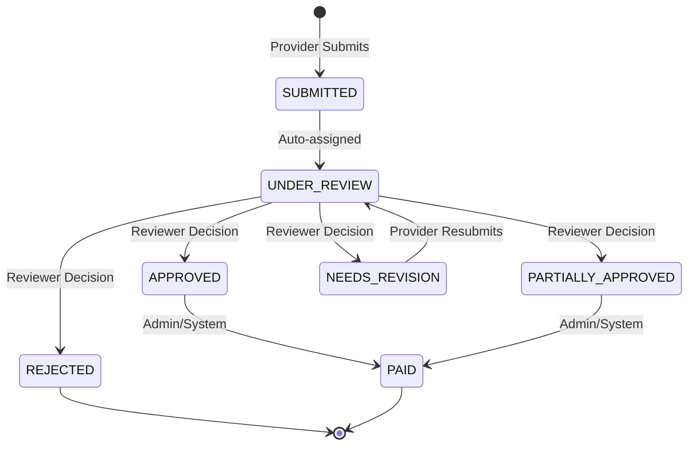

# Health Insurance Claims Backend 🏥

A secure, RESTful Node.js backend handling medical claim submissions, fraud detection, coverage calculations, and lifecycle management.

## 🚀 Tech Stack
- **Runtime**: Node.js
- **Framework**: Express.js
- **Database**: MongoDB (Mongoose)
- **Language**: TypeScript (Strict Mode)
- **Authentication**: JWT (JSON Web Tokens) with Refresh Tokens
- **File Uploads**: Multer (Local disk storage)

## 🏗 System Architecture

### Monolithic vs Decoupled
This backend is built as a **fully decoupled microservice**. It does not rely on the frontend repository, and has its own independent `package.json`, linting configurations, and deployment scripts. 

### Core Modules
1. **Claim Management (`claim.service.ts`)**: Handles the core lifecycle of a claim.
2. **Coverage Engine (`coverage.service.ts`)**: Calculates patient vs insurance responsibility based on an $500 Annual Deductible and 80% Co-Insurance model.
3. **Audit Trail Engine (`auditLog.repository.ts`)**: Enforces immutability by tracking all status transitions and edits with a strict, chronologically ordered event log.
4. **Fraud Detection (`admin.service.ts`)**: Automatically flags claims exceeding 3x the historical average for specific procedure codes.

## 🔄 Claim State Machine

The backend enforces strict state transitions. Invalid transitions (e.g., trying to pay a rejected claim) are blocked at the service layer.



## ⚙️ Environment Variables (`.env`)

```env
PORT=5000
MONGODB_URI=mongodb://localhost:27017/insurance-claims
JWT_SECRET=your_super_secret_key_change_in_production
JWT_REFRESH_SECRET=your_super_secret_refresh_key_change_in_production
JWT_EXPIRES_IN=30m
JWT_REFRESH_EXPIRES_IN=7d
```

## 🛠 Local Development

```bash
# 1. Install dependencies
npm install

# 2. Run strictly typed linter & formatter
npm run check:all

# 3. Start development server
npm run dev
```

## 📁 Project Structure
```text
/src
├── /controllers   # HTTP request/response handlers
├── /middleware    # JWT Auth, Role Authorization, Multer Uploads
├── /models        # Mongoose Schemas (Claim, User, AuditLog)
├── /repositories  # Database access layer (abstraction over Mongoose)
├── /routes        # Express router definitions
├── /services      # Core business logic and calculations
└── /utils         # Global helpers and standardized API responses
```
